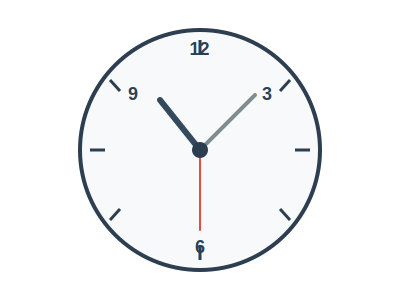

# アナログ時計 - 問題

## 問題1: アナログ時計のクラス設計

アナログ時計を表現するプログラムを作成します。以下の要件を満たすクラス設計を考えてください。

### 要件

1. アナログ時計は、**時計盤 (ClockFace)** と **針 (Hand)** から構成されます
2. 針には、**時針 (HourHand)**、**分針 (MinuteHand)**、**秒針 (SecondHand)** の3種類があります
3. 各針は、現在の角度を持ち、時間の経過とともに回転します
4. 時計盤は、12個の目盛りを持ちます

### 課題

1. 上記の要件を満たすクラス図を作成してください
2. クラス間の関係（継承、コンポジション、集約など）を明確にしてください
3. 各クラスの主要なプロパティとメソッドを定義してください

### ヒント

- すべての針に共通する機能は何でしょうか？
- 時計盤と針の関係はどのように表現できるでしょうか？
- 針の回転速度はどのように決まるでしょうか？

## 問題2: プログラムの実装

上記で設計したクラス図を基に、以下の機能を持つプログラムを実装してください。

### 実装する機能

1. 現在時刻を表示する
2. 各針の角度を計算する
3. 時間を進める（1秒ずつ）

### 実装言語

- Python
- HTML/CSS/JavaScript

### 注意点

- コードはできるだけシンプルに保ってください
- オブジェクト指向の原則に従ってください
- 各クラスの責務を明確にしてください
