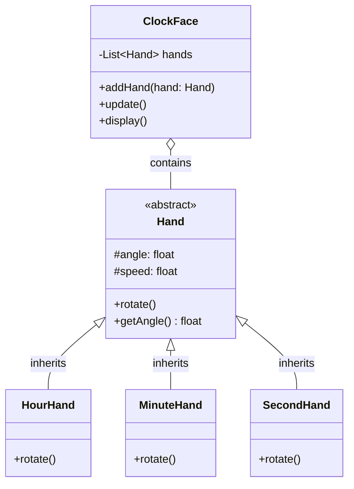

# アナログ時計 - 解答

## クラス図

## クラス設計の説明

### クラス間の関係

1. **継承 (Inheritance)**
   - `HourHand`、`MinuteHand`、`SecondHand` は `Hand` を継承します
   - すべての針に共通する機能（角度の保持、回転）を基底クラス `Hand` にまとめます

2. **コンポジション (Composition)**
   - `ClockFace` は複数の `Hand` を持ちます（`o--` で表現）
   - 時計盤は針を含み、針は時計盤の一部として存在します

### 各クラスの役割

#### Hand（抽象クラス）
- **責務**: すべての針に共通する基本機能を提供
- **プロパティ**:
  - `angle`: 現在の角度（0-360度）
  - `speed`: 回転速度（度/秒）
- **メソッド**:
  - `rotate()`: 針を回転させる
  - `getAngle()`: 現在の角度を取得

#### HourHand（時針）
- **責務**: 時針特有の動作を実装
- 12時間で360度回転（0.5度/分）

#### MinuteHand（分針）
- **責務**: 分針特有の動作を実装
- 60分で360度回転（6度/分）

#### SecondHand（秒針）
- **責務**: 秒針特有の動作を実装
- 60秒で360度回転（6度/秒）

#### ClockFace（時計盤）
- **責務**: 針を管理し、時計全体を制御
- **プロパティ**:
  - `hands`: 針のリスト
- **メソッド**:
  - `addHand()`: 針を追加
  - `update()`: すべての針を更新
  - `display()`: 時計を表示

## 実装のポイント

### オブジェクト指向の原則

1. **カプセル化**: 各クラスは自身のデータとメソッドを持ちます
2. **継承**: 共通機能を基底クラスにまとめ、コードの重複を避けます
3. **ポリモーフィズム**: すべての針を `Hand` 型として扱えます
4. **単一責任の原則**: 各クラスは明確な責務を持ちます

### 実装例の説明

実装例は以下のファイルを参照してください：
- Python実装: `analog_clock.py`
- Web実装: `index.html`, `clock.js`, `style.css`
