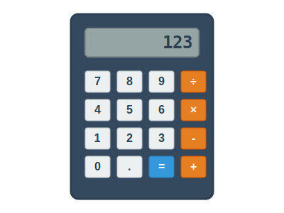

# 電卓 - 問題

## 問題1: 電卓のクラス設計

基本的な四則演算ができる電卓プログラムを作成します。以下の要件を満たすクラス設計を考えてください。

### 要件

1. 電卓は、**ディスプレイ (Display)**、**キーパッド (Keypad)**、**計算エンジン (CalculationEngine)** から構成されます
2. キーパッドには、**数字キー (NumberKey)** と **演算子キー (OperatorKey)** があります
3. 演算子には、**加算 (Addition)**、**減算 (Subtraction)**、**乗算 (Multiplication)**、**除算 (Division)** があります
4. 計算エンジンは、入力された数値と演算子を基に計算を実行します
5. ディスプレイは、現在の入力値または計算結果を表示します

### 課題

1. 上記の要件を満たすクラス図を作成してください
2. クラス間の関係（継承、コンポジション、集約など）を明確にしてください
3. 各クラスの主要なプロパティとメソッドを定義してください

### ヒント

- すべての演算子に共通する機能は何でしょうか？
- 電卓の各部品の関係はどのように表現できるでしょうか？
- 計算の状態（入力中、演算子待ち、結果表示中など）をどのように管理しますか？

## 問題2: プログラムの実装

上記で設計したクラス図を基に、以下の機能を持つプログラムを実装してください。

### 実装する機能

1. 数字の入力
2. 四則演算（+、-、×、÷）
3. 計算結果の表示
4. クリア機能（C）

### 実装言語

- Python
- HTML/CSS/JavaScript

### 注意点

- コードはできるだけシンプルに保ってください
- オブジェクト指向の原則に従ってください
- 各クラスの責務を明確にしてください
- エラー処理（0での除算など）も考慮してください
