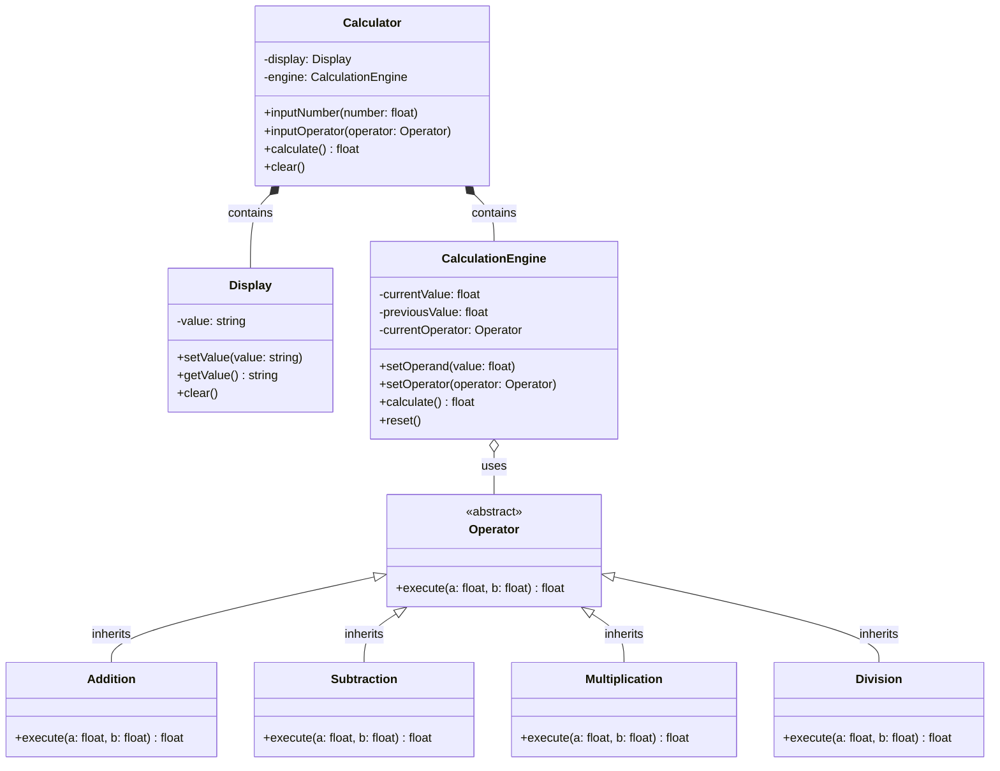

# 電卓 - 解答

## クラス図

## クラス設計の説明

### クラス間の関係

1. **継承 (Inheritance)**
   - `Addition`、`Subtraction`、`Multiplication`、`Division` は `Operator` を継承します
   - すべての演算子に共通する機能を基底クラス `Operator` にまとめます

2. **コンポジション (Composition)**
   - `Calculator` は `Display` と `CalculationEngine` を持ちます
   - これらは電卓の一部として存在します

3. **集約 (Aggregation)**
   - `CalculationEngine` は `Operator` を使用します
   - 演算子は独立して存在できます

### 各クラスの役割

#### Calculator（電卓）
- **責務**: 電卓全体を制御し、ユーザー入力を処理
- **メソッド**:
  - `inputNumber()`: 数字を入力
  - `inputOperator()`: 演算子を入力
  - `calculate()`: 計算を実行
  - `clear()`: クリア

#### Display（ディスプレイ）
- **責務**: 現在の値を表示
- **プロパティ**:
  - `value`: 表示する値
- **メソッド**:
  - `setValue()`: 値を設定
  - `getValue()`: 値を取得
  - `clear()`: クリア

#### CalculationEngine（計算エンジン）
- **責務**: 実際の計算を実行
- **プロパティ**:
  - `currentValue`: 現在の値
  - `previousValue`: 前の値
  - `currentOperator`: 現在の演算子
- **メソッド**:
  - `setOperand()`: オペランドを設定
  - `setOperator()`: 演算子を設定
  - `calculate()`: 計算を実行
  - `reset()`: リセット

#### Operator（演算子・抽象クラス）
- **責務**: 演算の基本インターフェースを提供
- **メソッド**:
  - `execute()`: 演算を実行

#### Addition/Subtraction/Multiplication/Division
- **責務**: 各演算を実装
- 加算: `a + b`
- 減算: `a - b`
- 乗算: `a × b`
- 除算: `a ÷ b`（0除算のエラー処理を含む）

## 実装のポイント

### オブジェクト指向の原則

1. **カプセル化**: 各クラスは自身のデータとメソッドを持ちます
2. **継承**: 演算子の共通機能を基底クラスにまとめます
3. **ポリモーフィズム**: すべての演算子を `Operator` 型として扱えます
4. **単一責任の原則**: 各クラスは明確な責務を持ちます

### 設計パターン

- **Strategy パターン**: 演算子を切り替え可能な戦略として実装
- 実行時に異なる演算アルゴリズムを選択できます

### 実装例の説明

実装例は以下のファイルを参照してください：
- Python実装: `calculator.py`
- Web実装: `index.html`, `calculator.js`, `style.css`
