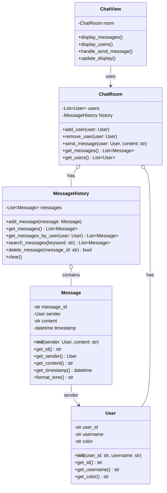

# チャットアプリ - 解答

## クラス図

## クラス設計の説明

### クラス間の関係

1. **関連 (Association)**
   - `Message` は `User` を送信者として持ちます
   - メッセージは送信者の情報を参照します

2. **コンポジション (Composition)**
   - `MessageHistory` は複数の `Message` を持ちます
   - `ChatRoom` は `User` と `MessageHistory` を持ちます
   - これらは密接に関連し、部分として存在します

3. **使用 (Uses)**
   - `ChatView` は `ChatRoom` を使用します
   - ビューはチャットルームの状態を表示します

### 各クラスの役割

#### User（ユーザー）
- **責務**: ユーザー情報を管理
- **プロパティ**:
  - `user_id`: ユーザーID
  - `username`: ユーザー名
  - `color`: ユーザーの表示色
- **メソッド**:
  - `get_id()`: ユーザーIDを取得
  - `get_username()`: ユーザー名を取得
  - `get_color()`: 表示色を取得

#### Message（メッセージ）
- **責務**: メッセージ情報を管理
- **プロパティ**:
  - `message_id`: メッセージID
  - `sender`: 送信者
  - `content`: メッセージ内容
  - `timestamp`: 送信時刻
- **メソッド**:
  - `get_id()`: メッセージIDを取得
  - `get_sender()`: 送信者を取得
  - `get_content()`: 内容を取得
  - `get_timestamp()`: 送信時刻を取得
  - `format_time()`: 時刻を整形して取得

#### MessageHistory（メッセージ履歴）
- **責務**: メッセージの保存と検索
- **プロパティ**:
  - `messages`: メッセージのリスト
- **メソッド**:
  - `add_message()`: メッセージを追加
  - `get_messages()`: すべてのメッセージを取得
  - `get_messages_by_user()`: 特定ユーザーのメッセージを取得
  - `search_messages()`: キーワードで検索
  - `delete_message()`: メッセージを削除
  - `clear()`: すべてのメッセージを削除

#### ChatRoom（チャットルーム）
- **責務**: チャット全体を管理
- **プロパティ**:
  - `users`: 参加ユーザーのリスト
  - `history`: メッセージ履歴
- **メソッド**:
  - `add_user()`: ユーザーを追加
  - `remove_user()`: ユーザーを削除
  - `send_message()`: メッセージを送信
  - `get_messages()`: メッセージ一覧を取得
  - `get_users()`: ユーザー一覧を取得

#### ChatView（表示・入力）
- **責務**: チャット画面の表示とユーザー入力を処理（View層）
- **プロパティ**:
  - `room`: 表示対象のチャットルーム
- **メソッド**:
  - `display_messages()`: メッセージを表示
  - `display_users()`: ユーザーリストを表示
  - `handle_send_message()`: メッセージ送信を処理
  - `update_display()`: 表示を更新

## 設計のポイント

### Model-View分離

- **Model層**: `User`, `Message`, `MessageHistory`, `ChatRoom`
  - チャットのデータとロジックを管理
  - 表示方法に依存しない
  
- **View層**: `ChatView`
  - 表示と入力のみを担当
  - チャットロジックを持たない

この分離により、コンソール版とWeb版で同じModelクラスを再利用できます。

### オブジェクト指向の原則

1. **カプセル化**: 各クラスは自身のデータとメソッドを持ちます
2. **単一責任の原則**: 各クラスは明確な責務を持ちます
3. **疎結合**: ModelとViewが分離されており、変更の影響を最小化

### 実装例の説明

実装例は以下のファイルを参照してください：
- Python実装: `chat.py`
- Web実装: `web/index.html`, `web/chat.js`, `web/style.css`
