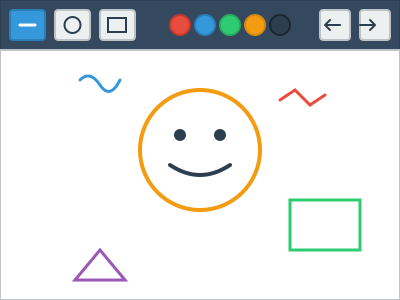

# お絵描きアプリ - 問題

## 問題1: お絵描きアプリのクラス設計

シンプルなお絵描きアプリケーションを作成します。以下の要件を満たすクラス設計を考えてください。

### 要件

1. **キャンバス (Canvas)**: 描画領域を管理します
2. **描画ツール (Tool)**: ペン、消しゴム、図形描画など、様々な描画ツールがあります
3. **図形 (Shape)**: 線、円、四角形など、描画される図形を表現します
4. **色 (Color)**: 描画色を管理します
5. **履歴管理 (History)**: 元に戻す/やり直し機能のための履歴を管理します

### 課題

1. 上記の要件を満たすクラス図を作成してください
2. クラス間の関係（継承、コンポジション、集約など）を明確にしてください
3. 各クラスの主要なプロパティとメソッドを定義してください

### ヒント

- すべてのツールに共通する機能は何でしょうか？
- 異なる種類の図形（線、円、四角形）をどのように抽象化できるでしょうか？
- キャンバスと図形の関係はどのように表現できるでしょうか？
- Model（描画データ）とView（画面表示）を分離するにはどうすればよいでしょうか？
- 元に戻す/やり直し機能を実現するためには、どのようなデータ構造が必要でしょうか？

## 問題2: プログラムの実装

上記で設計したクラス図を基に、以下の機能を持つプログラムを実装してください。

### 実装する機能

1. フリーハンド描画（ペンツール）
2. 直線の描画
3. 円の描画
4. 四角形の描画
5. 色の選択
6. 消しゴム機能
7. 全消去
8. 元に戻す/やり直し（Undo/Redo）

### 実装言語

- Python（tkinterを使用）
- HTML/CSS/JavaScript

### 注意点

- コードはできるだけシンプルに保ってください
- オブジェクト指向の原則に従ってください
- 各クラスの責務を明確にしてください
- Model（描画データ）とView（画面表示）を分離してください
