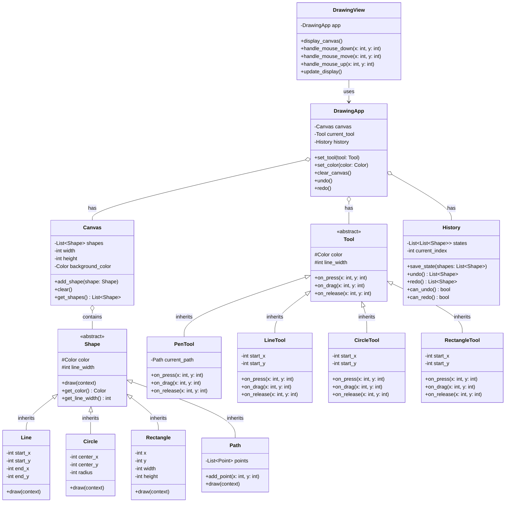

# お絵描きアプリ - 解答

## クラス図

## クラス設計の説明

### クラス間の関係

1. **継承 (Inheritance)**
   - `Line`, `Circle`, `Rectangle`, `Path` は `Shape` を継承します
   - `PenTool`, `LineTool`, `CircleTool`, `RectangleTool` は `Tool` を継承します
   - すべての図形とツールに共通する機能を基底クラスにまとめます

2. **コンポジション (Composition)**
   - `Canvas` は複数の `Shape` を持ちます
   - `DrawingApp` は `Canvas`, `Tool`, `History` を持ちます
   - これらは密接に関連し、アプリケーションの一部として存在します

3. **関連 (Association)**
   - `DrawingView` は `DrawingApp` を使用します（uses-a の関係）
   - ビューはアプリケーションの状態を表示し、ユーザー入力を処理します

### 各クラスの役割

#### Shape（抽象クラス）
- **責務**: すべての図形に共通する機能を定義
- **プロパティ**:
  - `color`: 図形の色
  - `line_width`: 線の太さ
- **メソッド**:
  - `draw()`: 図形を描画（抽象メソッド）

#### Line（直線）
- **責務**: 直線を表現
- **プロパティ**:
  - `start_x`, `start_y`: 開始座標
  - `end_x`, `end_y`: 終了座標

#### Circle（円）
- **責務**: 円を表現
- **プロパティ**:
  - `center_x`, `center_y`: 中心座標
  - `radius`: 半径

#### Rectangle（四角形）
- **責務**: 四角形を表現
- **プロパティ**:
  - `x`, `y`: 左上座標
  - `width`, `height`: 幅と高さ

#### Path（パス）
- **責務**: フリーハンドの線を表現
- **プロパティ**:
  - `points`: 座標点のリスト

#### Tool（抽象クラス）
- **責務**: 描画ツールの共通機能を定義
- **プロパティ**:
  - `color`: 描画色
  - `line_width`: 線の太さ
- **メソッド**:
  - `on_press()`: マウス押下時の処理
  - `on_drag()`: ドラッグ時の処理
  - `on_release()`: マウス離した時の処理

#### PenTool（ペンツール）
- **責務**: フリーハンド描画
- ドラッグ中に座標を記録し、`Path` 図形を作成

#### LineTool（直線ツール）
- **責務**: 直線を描画
- 開始点と終了点から `Line` 図形を作成

#### CircleTool（円ツール）
- **責務**: 円を描画
- 中心点と半径から `Circle` 図形を作成

#### RectangleTool（四角形ツール）
- **責務**: 四角形を描画
- 対角の2点から `Rectangle` 図形を作成

#### Canvas（キャンバス）
- **責務**: 描画領域とすべての図形を管理
- **プロパティ**:
  - `shapes`: 描画された図形のリスト
  - `width`, `height`: キャンバスのサイズ
- **メソッド**:
  - `add_shape()`: 図形を追加
  - `clear()`: すべての図形を削除
  - `get_shapes()`: 図形リストを取得

#### History（履歴管理）
- **責務**: 元に戻す/やり直し機能を提供
- **プロパティ**:
  - `states`: 状態履歴のリスト
  - `current_index`: 現在の位置
- **メソッド**:
  - `save_state()`: 現在の状態を保存
  - `undo()`: 1つ前の状態に戻る
  - `redo()`: 1つ後の状態に進む

#### DrawingApp（アプリケーション管理）
- **責務**: アプリケーション全体を管理
- **プロパティ**:
  - `canvas`: 描画キャンバス
  - `current_tool`: 現在選択されているツール
  - `history`: 履歴管理
- **メソッド**:
  - `set_tool()`: ツールを変更
  - `set_color()`: 色を変更
  - `clear_canvas()`: キャンバスをクリア
  - `undo()`, `redo()`: 元に戻す/やり直し

#### DrawingView（表示・入力）
- **責務**: キャンバスの表示とユーザー入力を処理（View層）
- **プロパティ**:
  - `app`: 表示対象のアプリケーション
- **メソッド**:
  - `display_canvas()`: キャンバスを表示
  - `handle_mouse_down()`: マウス押下を処理
  - `handle_mouse_move()`: マウス移動を処理
  - `handle_mouse_up()`: マウス離すを処理
  - `update_display()`: 表示を更新

## 設計のポイント

### Model-View分離

- **Model層**: `Canvas`, `Shape`, `Tool`, `History`, `DrawingApp`
  - 描画データとロジックを管理
  - 表示方法に依存しない
  
- **View層**: `DrawingView`
  - 表示と入力のみを担当
  - 描画ロジックを持たない

この分離により、tkinter版とWeb版で同じModelクラスを再利用できます。

### オブジェクト指向の原則

1. **カプセル化**: 各クラスは自身のデータとメソッドを持ちます
2. **継承**: 図形とツールの共通機能を基底クラスにまとめます
3. **ポリモーフィズム**: すべての図形を `Shape` 型として統一的に扱えます
4. **単一責任の原則**: 各クラスは明確な責務を持ちます

### 実装例の説明

実装例は以下のファイルを参照してください：
- Python実装: `drawing.py`
- Web実装: `web/index.html`, `web/drawing.js`, `web/style.css`
