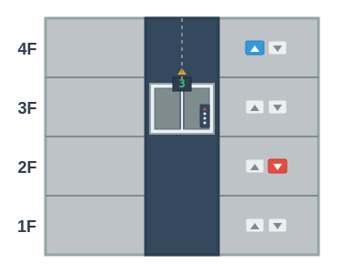

# エレベーター制御 - 問題

## 問題1: エレベーター制御のクラス設計

複数階建てのビルのエレベーター制御システムを作成します。以下の要件を満たすクラス設計を考えてください。

### 要件

1. **エレベーター (Elevator)**: エレベーターの状態（現在階、方向、ドア開閉）を管理します
2. **リクエスト (Request)**: 各階からの呼び出しリクエストを管理します
3. **制御システム (ElevatorController)**: エレベーターの動きを制御します
4. **表示 (Display)**: エレベーターの状態を表示します

### 課題

1. 上記の要件を満たすクラス図を作成してください
2. クラス間の関係（継承、コンポジション、集約など）を明確にしてください
3. 各クラスの主要なプロパティとメソッドを定義してください

### ヒント

- エレベーターの状態（停止中、上昇中、下降中）をどのように表現しますか？
- リクエストの優先順位はどのように決定しますか？
- Model（制御ロジック）とView（画面表示）を分離するにはどうすればよいでしょうか？

## 問題2: プログラムの実装

上記で設計したクラス図を基に、以下の機能を持つプログラムを実装してください。

### 実装する機能

1. 階の移動
2. ドアの開閉
3. リクエストの追加
4. 最適な階への移動
5. 現在状態の表示

### 実装言語

- Python
- HTML/CSS/JavaScript

### 注意点

- コードはできるだけシンプルに保ってください
- オブジェクト指向の原則に従ってください
- 各クラスの責務を明確にしてください
