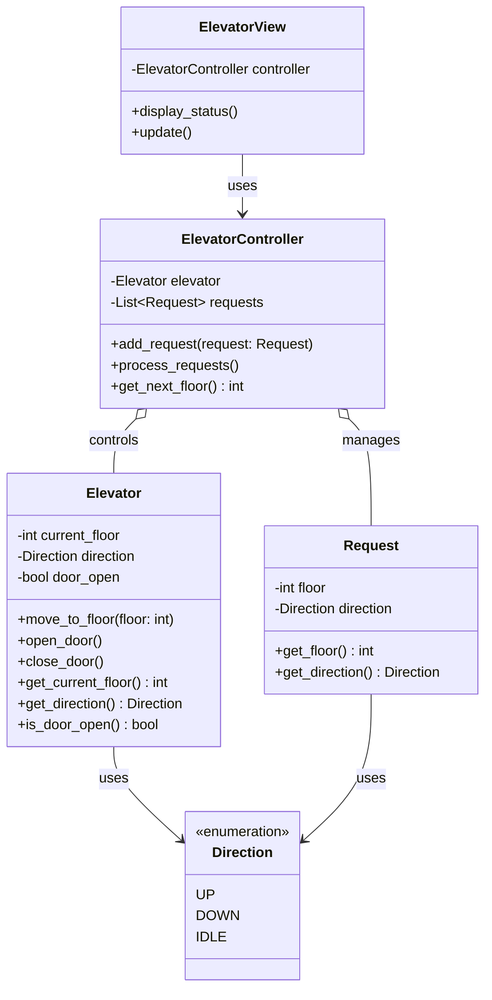

# エレベーター制御 - 解答

## クラス図

## クラス設計の説明

### 各クラスの役割

#### Direction（方向）
- **責務**: エレベーターの移動方向を表現
- **値**: UP（上昇）、DOWN（下降）、IDLE（停止）

#### Elevator（エレベーター）
- **責務**: エレベーターの状態と動作を管理
- **プロパティ**: 現在階、方向、ドア状態

#### Request（リクエスト）
- **責務**: 各階からの呼び出しを表現
- **プロパティ**: 目的階、方向

#### ElevatorController（制御システム）
- **責務**: リクエストを管理し最適な動作を決定
- **メソッド**: リクエスト追加、処理、次の階決定

#### ElevatorView（表示）
- **責務**: エレベーターの状態表示（View層）

## 設計のポイント

### Model-View分離
- **Model層**: Elevator, Request, ElevatorController
- **View層**: ElevatorView

### 実装例
- Python実装: `elevator.py`
- Web実装: `web/index.html`, `web/elevator.js`, `web/style.css`
