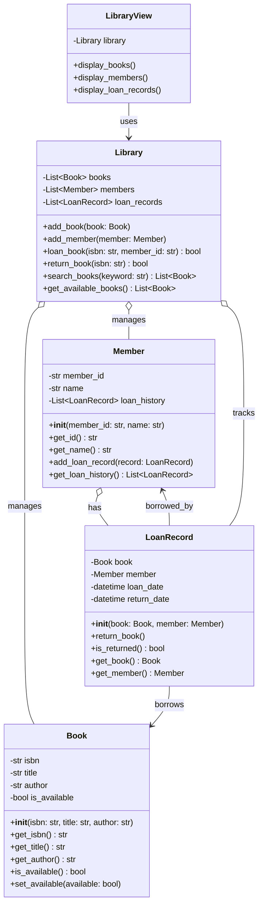

# 図書管理システム - 解答

## クラス図

## クラス設計の説明

### 各クラスの役割

#### Book（書籍）
- **責務**: 書籍情報を管理
- **プロパティ**: ISBN、タイトル、著者、貸出可否

#### Member（利用者）
- **責務**: 利用者情報と貸出履歴を管理
- **プロパティ**: 会員ID、名前、貸出履歴

#### LoanRecord（貸出記録）
- **責務**: 貸出と返却の記録を管理
- **プロパティ**: 書籍、利用者、貸出日、返却日

#### Library（図書館）
- **責務**: 蔵書と貸出を総合管理
- **メソッド**: 書籍登録、利用者登録、貸出、返却、検索

#### LibraryView（表示）
- **責務**: 図書館情報の表示（View層）

## 設計のポイント

### Model-View分離
- **Model層**: Book, Member, LoanRecord, Library
- **View層**: LibraryView

### 実装例
- Python実装: `library.py`
- Web実装: `web/index.html`, `web/library.js`, `web/style.css`
