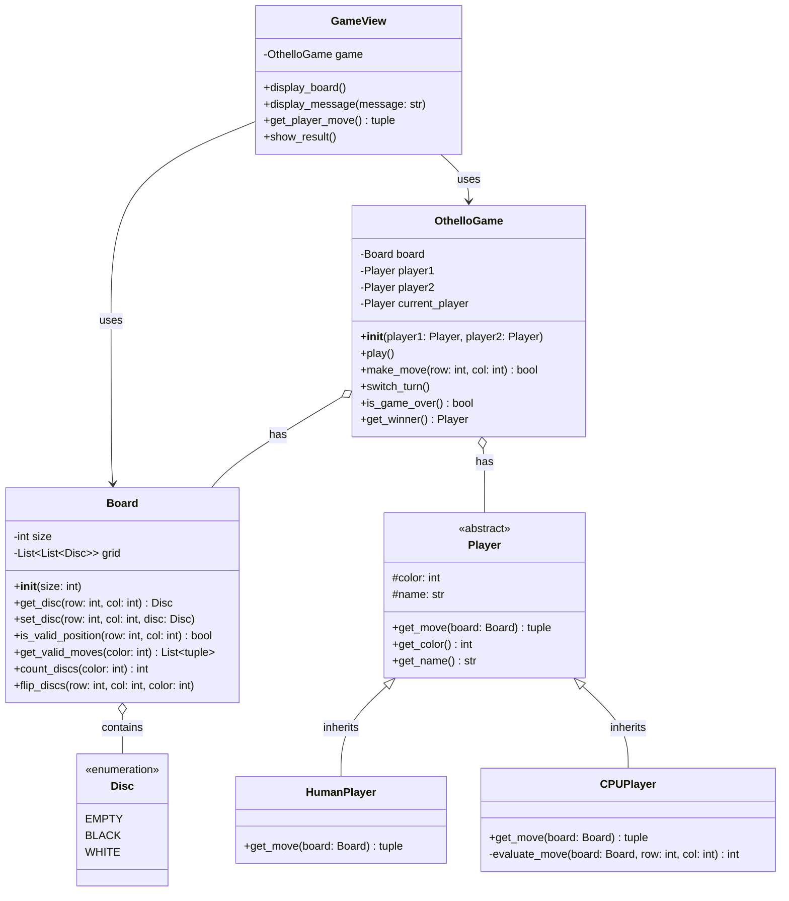

# オセロゲーム - 解答

## クラス図

## クラス設計の説明

### クラス間の関係

1. **継承 (Inheritance)**
   - `HumanPlayer` と `CPUPlayer` は `Player` を継承します
   - すべてのプレイヤーに共通する機能（色の管理、名前の取得）を基底クラス `Player` にまとめます

2. **コンポジション (Composition)**
   - `Board` は複数の `Disc` を持ちます（グリッド構造）
   - `OthelloGame` は `Board` と `Player` を持ちます
   - ボードや石は、ゲームの一部として存在します

3. **関連 (Association)**
   - `GameView` は `OthelloGame` と `Board` を使用します（uses-a の関係）
   - ビューはゲームの状態を表示するために、ゲームとボードを参照します

### 各クラスの役割

#### Disc（列挙型）
- **責務**: 石の状態を表現
- **値**:
  - `EMPTY`: 空のマス
  - `BLACK`: 黒石
  - `WHITE`: 白石

#### Board（ボード）
- **責務**: ボードの状態を管理し、ゲームロジックを提供
- **プロパティ**:
  - `size`: ボードのサイズ（通常は8）
  - `grid`: 石の配置を表す2次元リスト
- **メソッド**:
  - `get_disc()`: 指定位置の石を取得
  - `set_disc()`: 指定位置に石を配置
  - `is_valid_position()`: 位置が盤面内かチェック
  - `get_valid_moves()`: 指定色の合法手リストを取得
  - `count_discs()`: 指定色の石の数をカウント
  - `flip_discs()`: 石を反転させる

#### Player（抽象クラス）
- **責務**: プレイヤーの共通機能を定義
- **プロパティ**:
  - `color`: プレイヤーの石の色
  - `name`: プレイヤー名
- **メソッド**:
  - `get_move()`: 次の手を取得（抽象メソッド）
  - `get_color()`: 石の色を取得
  - `get_name()`: プレイヤー名を取得

#### HumanPlayer（人間プレイヤー）
- **責務**: ユーザー入力を受け付ける
- **メソッド**:
  - `get_move()`: ユーザーからの入力を取得

#### CPUPlayer（CPUプレイヤー）
- **責務**: 自動的に手を選択する
- **メソッド**:
  - `get_move()`: 合法手から最適な手を選択
  - `evaluate_move()`: 手の評価値を計算（簡易AI）

#### OthelloGame（ゲーム管理）
- **責務**: ゲーム全体の進行を管理
- **プロパティ**:
  - `board`: ゲームボード
  - `player1`, `player2`: 2人のプレイヤー
  - `current_player`: 現在の手番のプレイヤー
- **メソッド**:
  - `play()`: ゲームのメインループ
  - `make_move()`: 指定位置に石を置く
  - `switch_turn()`: 手番を交代
  - `is_game_over()`: ゲーム終了判定
  - `get_winner()`: 勝者を判定

#### GameView（表示・入力）
- **責務**: ゲームの表示とユーザー入力を処理（View層）
- **プロパティ**:
  - `game`: 表示対象のゲーム
- **メソッド**:
  - `display_board()`: ボードを表示
  - `display_message()`: メッセージを表示
  - `get_player_move()`: プレイヤーの入力を取得
  - `show_result()`: ゲーム結果を表示

## 設計のポイント

### Model-View分離

- **Model層**: `Board`, `Disc`, `Player`, `OthelloGame`
  - ゲームのロジックとデータを管理
  - 表示方法に依存しない
  
- **View層**: `GameView`
  - 表示と入力のみを担当
  - ゲームロジックを持たない

この分離により、コンソール版とWeb版で同じModelクラスを再利用できます。

### オブジェクト指向の原則

1. **カプセル化**: 各クラスは自身のデータとメソッドを持ちます
2. **継承**: プレイヤーの共通機能を基底クラスにまとめます
3. **ポリモーフィズム**: HumanPlayerとCPUPlayerをPlayer型として統一的に扱えます
4. **単一責任の原則**: 各クラスは明確な責務を持ちます

### 実装例の説明

実装例は以下のファイルを参照してください：
- Python実装: `othello.py`
- Web実装: `web/index.html`, `web/othello.js`, `web/style.css`
