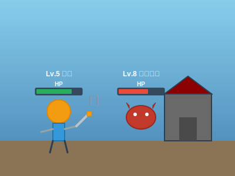

# Role Playing Game - 問題

## 問題1: RPGのクラス設計

シンプルなRole Playing Game（RPG）を作成します。以下の要件を満たすクラス設計を考えてください。

### 要件

1. ゲームには、**キャラクター (Character)** が登場します
2. キャラクターには、**プレイヤー (Player)** と **敵 (Enemy)** がいます
3. すべてのキャラクターは、**名前 (name)**、**HP (hitPoints)**、**攻撃力 (attackPower)** を持ちます
4. プレイヤーは、**経験値 (experience)** と **レベル (level)** を持ちます
5. キャラクターは、**攻撃 (attack)** や **ダメージを受ける (takeDamage)** アクションができます
6. プレイヤーには、**戦士 (Warrior)**、**魔法使い (Mage)**、**盗賊 (Thief)** などの職業があります
7. 各職業は異なる能力を持ちます

### 課題

1. 上記の要件を満たすクラス図を作成してください
2. クラス間の関係（継承、コンポジション、集約など）を明確にしてください
3. 各クラスの主要なプロパティとメソッドを定義してください

### ヒント

- プレイヤーと敵の共通する機能は何でしょうか？
- 職業ごとの違いをどのように表現しますか？
- キャラクター同士の戦闘はどのように実装しますか？

## 問題2: プログラムの実装

上記で設計したクラス図を基に、以下の機能を持つプログラムを実装してください。

### 実装する機能

1. キャラクターの作成
2. 攻撃アクション
3. ダメージ計算
4. HP管理
5. 経験値とレベルアップ
6. 簡単な戦闘シミュレーション

### 実装言語

- Python
- HTML/CSS/JavaScript

### 注意点

- コードはできるだけシンプルに保ってください
- オブジェクト指向の原則に従ってください
- 各クラスの責務を明確にしてください
- ゲームのルールは単純化してOKです
