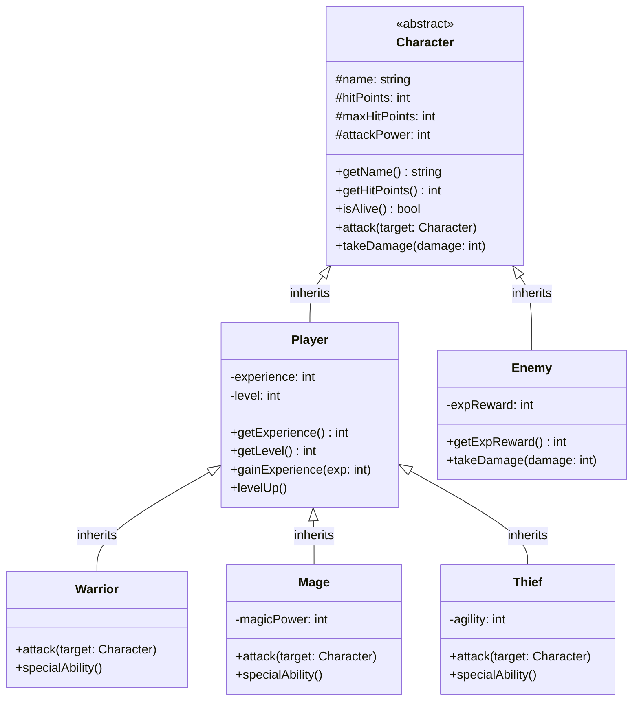

# Role Playing Game - 解答

## クラス図

## クラス設計の説明

### クラス間の関係

1. **継承 (Inheritance)**
   - `Player` と `Enemy` は `Character` を継承します
   - `Warrior`、`Mage`、`Thief` は `Player` を継承します
   - すべてのキャラクターに共通する機能を基底クラス `Character` にまとめます

### 各クラスの役割

#### Character（キャラクター・抽象クラス）
- **責務**: すべてのキャラクターに共通する基本機能を提供
- **プロパティ**:
  - `name`: キャラクター名
  - `hitPoints`: 現在のHP
  - `maxHitPoints`: 最大HP
  - `attackPower`: 攻撃力
- **メソッド**:
  - `getName()`: 名前を取得
  - `getHitPoints()`: HPを取得
  - `isAlive()`: 生存確認
  - `attack()`: 攻撃する
  - `takeDamage()`: ダメージを受ける

#### Player（プレイヤー）
- **責務**: プレイヤー固有の機能を提供
- **プロパティ**:
  - `experience`: 経験値
  - `level`: レベル
- **メソッド**:
  - `getExperience()`: 経験値を取得
  - `getLevel()`: レベルを取得
  - `gainExperience()`: 経験値を獲得
  - `levelUp()`: レベルアップ

#### Enemy（敵）
- **責務**: 敵キャラクターの機能を提供
- **プロパティ**:
  - `expReward`: 倒された時の経験値報酬
- **メソッド**:
  - `getExpReward()`: 経験値報酬を取得

#### Warrior（戦士）
- **責務**: 戦士職の特性を実装
- 高いHP と攻撃力
- 特殊能力: 強力な一撃

#### Mage（魔法使い）
- **責務**: 魔法使い職の特性を実装
- **プロパティ**:
  - `magicPower`: 魔法攻撃力
- 魔法攻撃が可能
- 特殊能力: 魔法攻撃

#### Thief（盗賊）
- **責務**: 盗賊職の特性を実装
- **プロパティ**:
  - `agility`: 素早さ
- 高い回避率
- 特殊能力: クリティカルヒット

## 実装のポイント

### オブジェクト指向の原則

1. **カプセル化**: 各クラスは自身のデータとメソッドを持ちます
2. **継承**: 共通機能を基底クラスにまとめ、コードの重複を避けます
3. **ポリモーフィズム**: すべてのキャラクターを `Character` 型として扱えます
4. **単一責任の原則**: 各クラスは明確な責務を持ちます

### ゲームの流れ

1. プレイヤーキャラクターを作成（職業選択）
2. 敵キャラクターと遭遇
3. ターン制の戦闘
4. 勝利したら経験値獲得
5. レベルアップで能力向上

### 拡張性

このクラス設計により、以下の拡張が容易になります：
- 新しい職業の追加
- 新しい敵タイプの追加
- アイテムシステムの追加
- スキルシステムの追加

### 実装例の説明

実装例は以下のファイルを参照してください：
- Python実装: `rpg.py`
- Web実装: `index.html`, `rpg.js`, `style.css`
